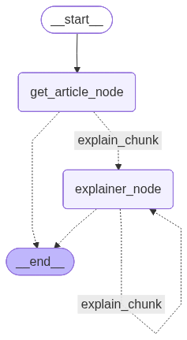

Article Explainer
--

Article Explainer is a full-stack application.

The backend uses FastAPI to serve frontend calls. And the frontend is a React.js application.

Backend Application
--

The backend application uses FastAPI to build an API with the goal of serving user calls. The API uses two main routes, the <b>graph router</b> and the <b>user router,</b> found at [Backend_app/src/API/Routers/](https://github.com/c-azb/ArticleExplainer_cicd_AWS/tree/main/Backend_app/src/API/Routers).

The <b>user router</b> manages the user login, registration, access token, and refresh token by interacting with a <b>MongoDB database</b>.

The <b>graph router</b> is responsible for making calls to the AI system, which is a <b>LangGraph graph</b> found at [Backend_app/src/graph/](https://github.com/c-azb/ArticleExplainer_cicd_AWS/tree/main/Backend_app/src/graph). The graph was built using an agent capable of producing a final full article explanation by combining small explanations of the article chunks.

The AI graph is also responsible for extracting the article by a user input. The Article extraction was made using the <b>arXiv service</b>.

If the user is logged in after each explanation is generated, the explanation is stored in the database so he can visualize it later.

<h3>Graph workflow image </h3>

Frontend Application
--

The frontend application is a React.js application that interacts with the backend API by creating a friendly and interactive interface for the user.

Deployment
--

For the deployment, a CI/CD workflow using GitHub Actions found at [.github/workflows](https://github.com/c-azb/ArticleExplainer_cicd_GCP/tree/main/.github/workflows) was used. It uses two workflows: <b>backend_workflow.yaml</b> and <b>frontend_workflow.yaml</b>. 

The <b>backend_workflow.yaml</b> builds an image using a [Dockerfile](https://github.com/c-azb/ArticleExplainer_cicd_GCP/blob/main/Backend_app/Dockerfile) with <b>Google Cloud Build</b> and deploys it to <b>Google Cloud Run</b>.

The <b>frontend_workflow.yaml</b> deploys the frontend application to the <b>Google Firebase Hosting</b> service to host a static website that calls the backend application hosted at <b>Cloud Run</b>.
